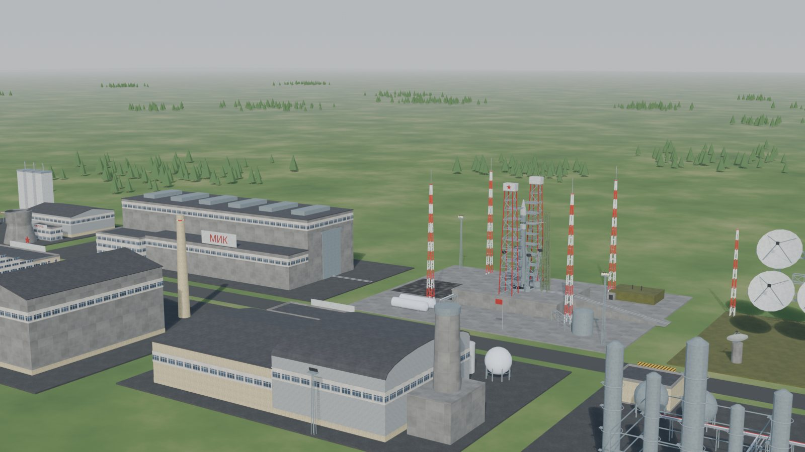
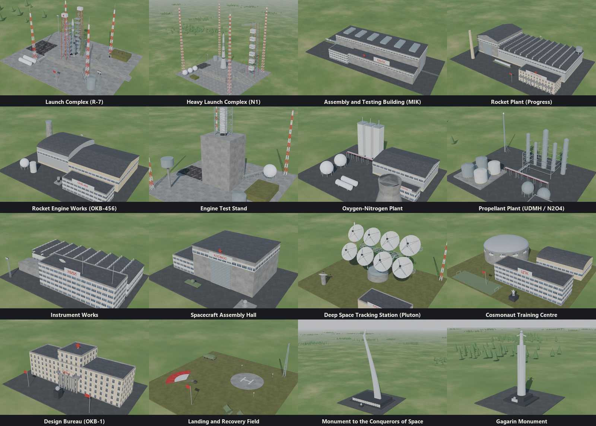
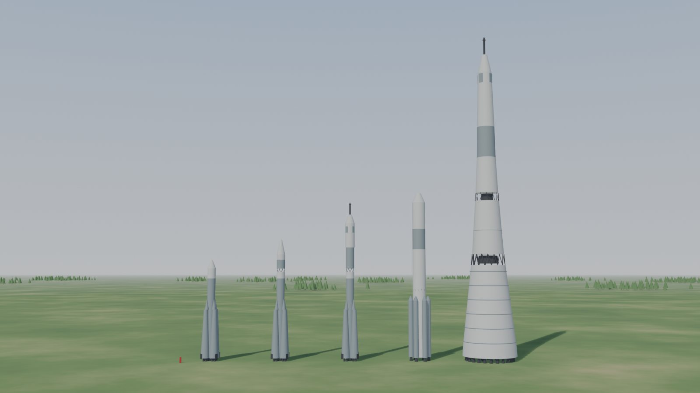
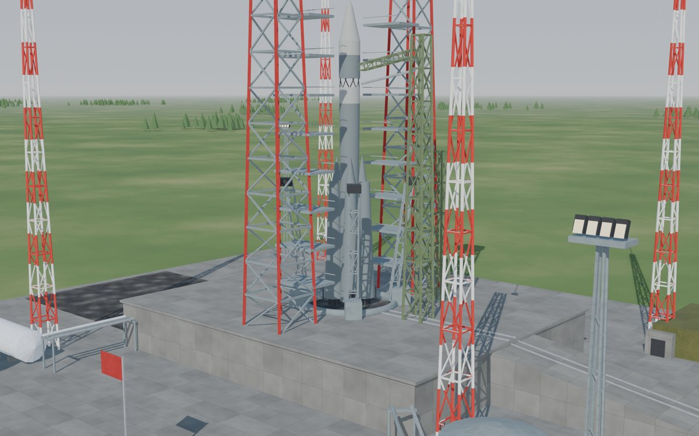
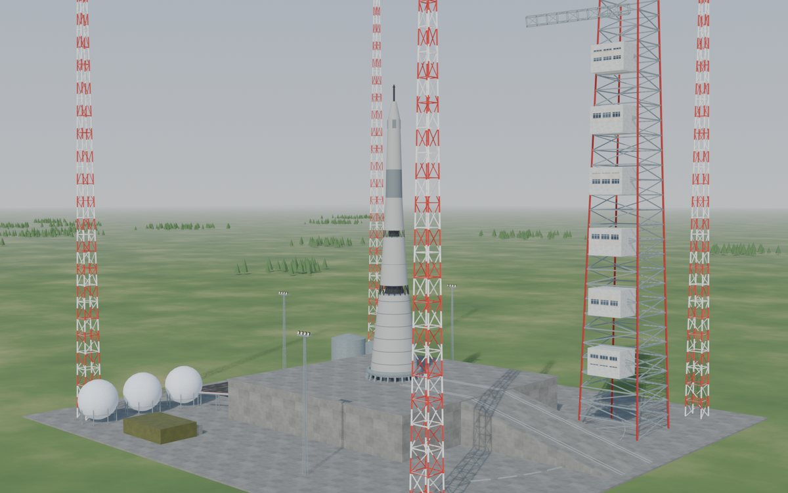

# Space Race for Workers & Resources: Soviet Republic



*A cosmodrome in an ordinary republic. The Americans have not been told.*

## COMRADE, THE AMERICANS ARE BUILDING A ROCKET!

Your republic pours concrete by the thousand tonnes, bakes bread for a million citizens and
runs trains on time, and yet the night sky above it contains **nothing Soviet whatsoever?**

Your best graduates are wasting their education in a distribution office when they could
be orbiting the planet?

Your steppe has plenty of empty space, and none of it is shaped like a launch pad?

**THE STATE COMMISSION HAS REVIEWED THIS SITUATION AND FOUND IT IDEOLOGICALLY UNACCEPTABLE.**

The Ministry of General Machine Building (a name chosen so that nobody would guess what it
builds) therefore presents the **Space Race**: a mod that turns your republic into a
spacefaring power, one satellite, cosmonaut and extremely large explosion at a time.

The objective is simple: **put a Soviet cosmonaut on the Moon before 20 July 1969.** The
Americans have a head start, a larger budget and Apollo 11. You have kerosene, liquid
oxygen and a Five-Year Plan.

The programme stays asleep until you research the *Rocket Research Institute*, so it
waits politely in any ordinary republic. An Early Start (1920) game reaches it by the
1950s, which is plenty of time if the cement works cooperate.

> **Status: under construction, like most of the republic.** Every feature below has run
> in the game, but nobody has played the full race yet. `mod/plugins/spacerace/spacerace.ini`
> ships with `test_mode = 1` (space research at 5 % of its cost) so that the testers could
> reach the Moon before retirement. Set it to `0` for a real Five-Year Plan.

## WHAT THE STATE HAS APPROVED

- **A space branch in the research tree.** 17 entries from 1946 to 1966, hanging off
  *Advanced Engineering Study* and *Electronic Circuits*. Each unlocks its buildings; none
  of them unlocks a holiday.
- **16 buildings modelled on the real ones.**
  - Launch: the R-7 launch complex (Gagarin's Start), the N1 heavy complex (Site 110) and
    the MIK assembly building.
  - Rockets and parts: the Progress rocket plant, the OKB-456 engine works, an engine test
    stand, oxygen and propellant plants, instrument works and a spacecraft hall.
  - Flight and crew: the Pluton tracking station, Star City, OKB-1 and a recovery field.
  - Two monuments, so the republic can admire itself.

  
- **Five rockets:** R-7 Sputnik, Vostok-K, Soyuz, Proton and the N1. The MIK builds them from
  rocket stages, engines and avionics, then rolls them out onto the pad it is linked to.
  The N1 needs the heavy complex; the others launch from Gagarin's Start. No amount of
  pushing will fit an N1 onto an R-7 pad.

  
- **Six new goods, if the republic wants them,** each with its own industry chain: rocket
  stages, rocket engines, avionics, liquid oxygen, hypergolic propellant and spacecraft.
  The truck drivers have been briefed and sworn to secrecy. They are off unless you switch
  them on (see *Saves*), and the programme then runs on the goods your republic already
  trades in: chemicals for the oxygen, mechanical components for the rocket parts,
  electronics for the spacecraft.
- **Cosmonauts: a fourth education tier.** Graduates aged 23 to 35 in good health who work at
  Star City join a class of 40. After about a year they come out as *experts*
  (education 3+). OKB-1 turns engineers aged 30 to 65 into chief designers the same way,
  at two years a tier, because designing takes longer than flying. Crewed flights will
  not leave without cosmonauts. The tier is a separate plugin that other mods can reuse,
  in case other ministries also want experts.
- **The programme:** eight milestones raced against the real American timeline. Getting
  there first pays in dollars and loyalty; getting there second pays less. Whenever the
  Americans get somewhere first, a notification tells you so and the citizens take it
  personally.

## THE EIGHT-POINT PLAN

| # | Milestone | Rocket | The Americans get there |
|---|---|---|---|
| 1 | The first satellite | R-7 Sputnik | January 1958 (Explorer 1) |
| 2 | A passenger in orbit | R-7 Sputnik | January 1961 (Ham the chimpanzee) |
| 3 | To the Moon | Vostok-K | April 1962 (Ranger 4) |
| 4 | The first man in space | Vostok-K | February 1962 (John Glenn) |
| 5 | A walk in space | Soyuz | June 1965 (Ed White) |
| 6 | Rendezvous and docking | Soyuz | March 1966 (Gemini 8) |
| 7 | Around the Moon | Proton | December 1968 (Apollo 8) |
| 8 | A Soviet footprint on the Moon | N1 | **20 July 1969 (Apollo 11)** |

Historically, the Soviet Union got to six of these eight first. The Central Committee
has reviewed that result and expects eight.

## LAUNCH PROCEDURE

*As approved by the State Commission, in triplicate:*

1. **Research the milestone.**
2. **Build the rocket at the MIK.** It rolls out onto the MIK's launch pad by itself.
3. **Stock the fuel and payload in storage buildings within 450 m of the pad.** That
   means kerosene, liquid oxygen, the spacecraft and, for anyone breathing, food.
   The Proton burns hypergolic propellant instead, which is exactly as pleasant as it
   sounds.
4. **Staff the flight.** Crewed milestones need trained cosmonauts, and from the Moon
   probe onwards up to three tracking stations must follow the flight.
5. **Stand well back.**



The programme takes the fuel and payload from those buildings, and the rocket climbs away
on a column of flame and smoke.

Or it doesn't.

### When it doesn't

- **The odds.** Every launch can fail. The chance drops by 5 % for each earlier success of
  the same rocket, and by another 10 % once the republic has an engine test stand. It never
  goes below 5 %, because space is hard.
- **The N1.** It starts at 70 %. Research the NK-33 engines, or keep the fire brigade
  on speed dial.
- **The aftermath.** A failure destroys the rocket and sets the pad on fire, so send the
  fire brigade. In a game with building fires switched off, the pad closes for 30 days of
  repairs instead.
- **The press.** Either way, TASS will not be mentioning it.



*The N1 on Site 110. Historically: four launches, four explosions, zero press releases.*

## NOT INCLUDED

- No Americans on the map. They exist only as notifications, which is how the Politburo
  prefers them.
- No orbital mechanics. The rocket goes up; space takes it from there.
- No promise that the N1 flies. The real one launched four times and exploded four times.

## THE PLAN IS NEGOTIABLE

Every number above is a recommendation from the Central Committee, not a law of physics.
They all live in `mod/plugins/spacerace/spacerace.ini`, which comes with every value
filled in and explained. Change one and restart the game:

| Section | What it controls |
|---|---|
| `[general]` | the switches: test mode, the new goods, the programme starting itself |
| `[research]` | the year each space entry opens and its cost, one by one or all at once (`year_shift`, `cost_scale`) |
| `[america]` | the day the Americans reach each milestone, shifted as a whole or set to `never` |
| `[milestones]` | failure chance, cosmonauts and tracking stations for each milestone |
| `[rockets]` | what each launch takes from the storages near its pad |
| `[rocket_parts]` | what the MIK builds each rocket from |
| `[launches]` | supply radius, repair time, and how fast experience and test stands make launches safer |
| `[rewards]` | the dollars and loyalty for coming first, second, or not at all |
| `[buildings]`, `[building:<name>]` | construction cost (sized from the model, or absolute: workdays and tonnes), staff and recipes of every building |

Research, buildings and rocket parts change in every game, saves included. The programme's
rules are fixed when a game starts: a republic keeps the rules it began with, so tampering
with the timeline cannot break a race already under way. New games take the new rules.
Cosmonaut training (how long, how many, who) is in `mod/plugins/experts/experts.ini`.

## REQUIREMENTS

- Workers & Resources: Soviet Republic **1.1.1.9**. The plugins patch this exact build and
  will not recognise any other.
- [Republic Mod Loader](https://steamcommunity.com/sharedfiles/filedetails/?id=3787969749)
  (RML), which hosts the plugins.
- To build: Windows, Visual Studio Build Tools (MSVC x64, Windows 10/11 SDK) and PowerShell.
- To regenerate the models, textures and scripts: Python 3 with `numpy` and `pillow`,
  and Blender 5.2 (`tools/build_space.py`). Only the reverse-engineering helpers in
  `tools/` need `capstone`.

**Saves:** out of the box (`new_goods = 0` in `spacerace.ini`) the mod adds no goods, and
your existing republic can join the race as it is. The six new goods (`new_goods = 1`)
change the save format: switch them on for a new game, because older saves will not load
with them and a game started with them needs them. Never switch them off under a save
that has them. The Party recommends a backup either way, like the Party always does.

## BUILD AND INSTALL

```powershell
.\build.ps1 -Install            # compile the plugins, then deploy into the game
.\build.ps1 -Install -Game 'D:\Games\SovietRepublic'
```

This installs seven local development items into `media_soviet\workshop_wip`:

| Item | What |
|---|---|
| 9000100 | the *Space Race* package: the `spacerace`, `experts` and `resources` plugins |
| 9000101 | the building kit |
| 9000111 to 9000115 | the five rockets |

Close the game and the loader before installing. The installer will not requisition files
that are still in use. Then open Republic Mod Loader, enable those development items
and the Space Race plugins, and launch.

## REBUILDING THE CONTENT

The research icons and the programme's window images are cut from the Blender renders,
so run `build_space.py` first (it leaves them in `build/space` and `build/space_vehicles`):

```
python tools/build_space.py            # textures, building kit, rockets, previews (needs Blender)
python tools/build_space.py kit mik    # one stage for some buildings only
python tools/space_research.py         # research branch, names and icons (needs the renders)
python tools/build_space.py inis       # only the buildings' ini files, stand-in and new-goods variants
python tools/space_scenario.py         # the programme template + launches.ini, checked by tools/vmcheck.py (needs the renders)
python tools/space_settings.py         # spacerace.ini's balance part and data/defaults.ini, from all of the above
python tools/space_workshop.py         # the seven Workshop items' configs and store pages, and kit_item
python tools/readme_images.py          # the pictures in this README (renders in Blender, then docs/images)
python tools/space_goods_icons.py      # icons of the new goods
python tools/space_layout.py           # checks every truck bay against the building models
python tools/port_resources.py         # re-ports the TesmioLoader resources plugin
```

Set `BLENDER` and `WRSR_GAME` if Blender or the game are not in their default folders.

## REPOSITORY LAYOUT

```
mod/plugins/spacerace/   research branch, programme autostart, launches, pad rules, goods for scripts
mod/plugins/experts/     the expert education tier (training classes per building)
mod/plugins/resources/   new goods: the TesmioLoader resources plugin, ported to RML
mod/packages/space_race/ the workshop item the plugins ship in
mod/buildings/space_kit/ the 16 buildings (generated)
mod/vehicles/sr_*/       the five rockets (generated)
tools/                   generators, checks and reverse-engineering helpers
tools/dev/               in-game test helpers (read/write a running game's memory)
docs/                    the design document, including what was verified in game and how; images/ for this page
vendor/TesmioLoader/     the loader API headers and the resources plugin source it was ported from
```

`docs/space-race-design.md` is the long version, classified only in spirit. It covers the
design, every engine address the plugins rely on and the full test history.

## BRANCHES

| Branch | What | How changes get in |
|---|---|---|
| `unstable` | day-to-day work; may not build | pushed to directly |
| `dev` | the next release, tested in game | pull request from `unstable`, approved by two maintainers |
| `main` | releases | pull request from `dev`, approved by @aislanfoina (code owner) |

`dev` and `main` are protected: no direct pushes, force pushes or deletions. Nothing
reaches `main` without the Chief Designer's signature.

## REPORTING A LAUNCH FAILURE

If something exploded that was not supposed to, open an issue with:
- what happened;
- what you were doing when it happened;
- the Republic Mod Loader log.

Unlike TASS, we want to hear about failures.

## LICENCE AND CREDITS

GPL-3.0; see `LICENSE`. The resources plugin is a port of the one in
[TesmioLoader](https://github.com/MaxLegend/TesmioLoader) by MaxLegend. Every plugin builds
against its GPL-3.0 API headers, so the whole repository uses the same licence. The plugins
run on [Republic Mod Loader](https://github.com/Ultimate-Universe/WRSR-RepublicModLoader) by
UltimateUniverse, whose Workshop pages also inspired the tone of this README.

Workers & Resources: Soviet Republic is © 3Division. This is an independent fan-made mod,
not affiliated with or endorsed by 3Division or Hooded Horse. It contains none of the game's
files; its models, textures and scripts are generated by the tools in this repository.

If the programme has served the republic, give the repository a star. The space programme
needs all the stars it can get.

---

**Build the rockets. Train the cosmonauts. Beat Apollo 11.**
**The Motherland is watching, Comrade, and so, unfortunately, are the Americans.**
